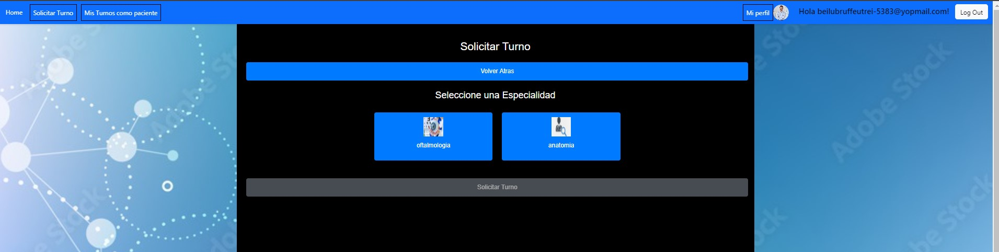
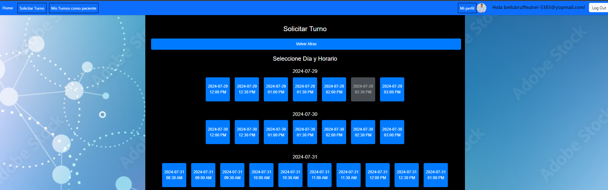

# TpClinica

Este proyecto fue generado con [Angular CLI](https://github.com/angular/angular-cli) version 15.2.4.

# Clínica Médica

## ¿Qué es la Clínica Médica?
Bienvenidos a la Clínica Médica, donde brindamos atención de calidad con un equipo profesional y comprometido con su salud. Desde consultas generales hasta especialidades y análisis de laboratorio.

## Horarios de Atención
- Lunes a Viernes: 08:00 AM - 19:00 PM
- Sábados: 08:00 AM - 14:00 PM

### 1. Página de Inicio

En la página principal, puedes echar un vistazo rápido a nuestros servicios, horarios y ubicación. Además, desde aquí puedes iniciar sesión o registrarte si eres nuevo.
En la página de inicio, puedes registrarte o iniciar sesión usando los botones de acceso rápido en la parte superior derecha.

### 2. Registro de Usuario

Si eres nuevo, puedes registrarte como paciente o especialista. Simplemente llena el formulario con tus datos personales y sube tu foto de perfil.
Para registrarte, haz clic en "Sos nuevo? Haz click aquí para Registrarse" en la parte superior derecha. Llena el formulario con tus datos y sube tus imágenes de perfil.

### 3. Login de Usuario

Si ya te registraste, solo ingresa tu email y contraseña, y selecciona si eres paciente, especialista o administrador. 
Para iniciar sesión, haz clic en "Loguearse" en la parte superior derecha. Ingresa tu email y contraseña, y selecciona tu tipo de cuenta.

### 4. Solicitar Turno

Aquí es donde los pacientes pueden reservar sus citas. Elige una especialidad, selecciona un especialista y escoge el horario que más te convenga.
Después de iniciar sesión como paciente, selecciona "Solicitar Turno" en la barra de navegación superior. Elige tu especialidad, especialista y horario.

### 5. Mis Turnos

Puedes revisar tus turnos, Filtra por especialidad y especialista, y si necesitas cancelar una cita, también puedes hacerlo desde aquí.
Después de iniciar sesión como paciente, selecciona "Mis Turnos como paciente" en la barra de navegación superior. Aquí puedes ver todas tus citas, filtrarlas y cancelarlas si es necesario.

